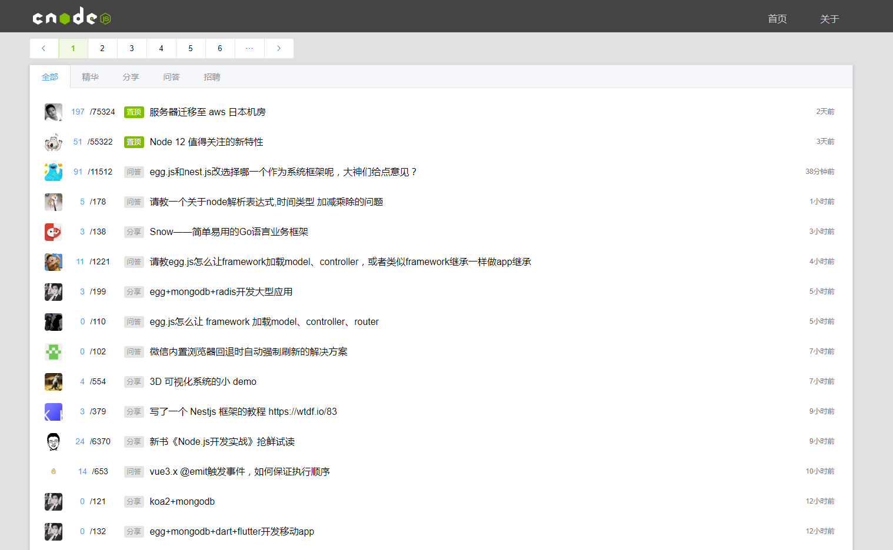
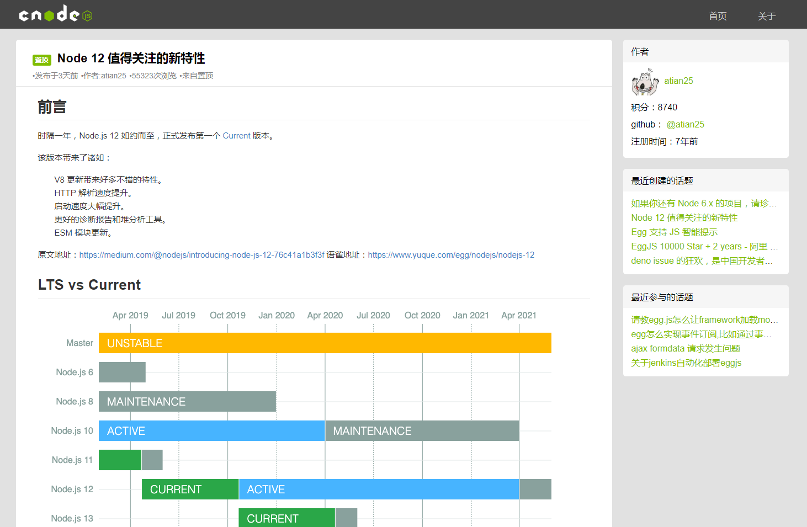

# Vue-CLI实现CNode社区

本项目利用CNode社区提供的API，使用Vue-CLI手脚架、Vue组件、Vue-router搭建仿CNode社区项目

[**预览地址**](https://brendanfich.github.io/vue_cnode/)

## 技术栈

- Vue-CLI 3:对比Vue-CLI 2.x，3.x集成度更高，在创建项目时提供常用插件。
- Vue-router:进行路径管理，利用hash模式模拟完整URL。
- Vuex:出于练手的原因，在首页各组件数据共享列表页数
- Axios:基于Promise，用于浏览器和Node.js的HTTP客户端，改写Vue原型链，并把Axios挂载其上。
- 其他: ES6, Vue.js(实现分页组件)，ElementUI(tab,dialog,button)等等。

使用Vue-CLI 3项目目录比2.x时期精简，去掉了build和config等目录，把对输出路径、预处理、webpack等的配置集成到vue.config.js（有些项目创建时没有自带vue.config.js文件，可后期手动添加到根目录）。

## 项目架构

```
|——index.html //Vue-CLI构建的最终SPA页面
|     |
|——App.vue //这是整个Vue项目的主组件，作为页面入口，其他组件都挂载到此组件中
|     |——Header.vue //顶部目录栏组件
|     |——Main.vue //首页组件
|           |__pagination.vue //此处把分页器提上，方便用户快速跳转页面
|           |__postList.vue //main views部分分为首页的文章列表、不同分类的文章列表
|     |——Article.vue //点击文章题目能进入文章详情页
|           |__SideBar.vue //文章右侧粗略展示作者信息，用户可点击查看详细信息
|     |__User.vue //用户详情页，包括用户基本资料、创建的话题和回复的话题
|           |__SideBar.vue //与Article中的SiderBar相似故复用，仅增加显示信息数量及宽度
```

## 项目截图

[**预览地址**](https://brendanfich.github.io/vue_cnode/)


